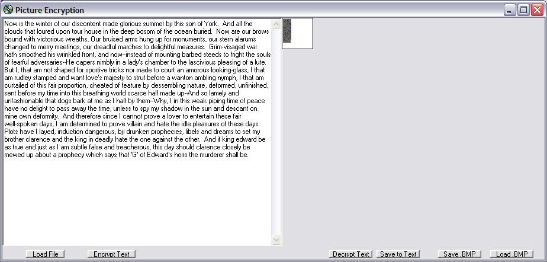



## Encrypt to \.bmp \*UPDATE AGAIN\*

### Description

Now, updated twice, from the great people who brought you the Venus Project and the Color Weaver, and a lot of help from Geoffrey Hazen, another great graphics program! Type in any text and it will encrypt it into a .bmp file. See Screenshot! Automatically saves .bmp files to C:\Encrypted File.bmp so you can just encrypt and close the program, and it will automatically load ht picture from the same place. Want to encrypt more than one file? No problem! Options to save and load other .bmp files! can't copy and paste? No problem! Options to load and save text files!
 
### More Info
 

             |
---                |---
**Submitted On**   |2002-03-14 20:22:48
**By**             |[Edward Dassmesser](https://github.com/Planet-Source-Code/PSCIndex/blob/master/ByAuthor/edward-dassmesser.md)
**Level**          |Beginner
**User Rating**    |5.0 (20 globes from 4 users)
**Compatibility**  |VB 5\.0, VB 6\.0
**Category**       |[Graphics](https://github.com/Planet-Source-Code/PSCIndex/blob/master/ByCategory/graphics__1-46.md)
**World**          |[Visual Basic](https://github.com/Planet-Source-Code/PSCIndex/blob/master/ByWorld/visual-basic.md)
**Archive File**   |[Encrypt\_to624993152002\.zip](https://github.com/Planet-Source-Code/edward-dassmesser-encrypt-to-bmp-update-again__1-32666/archive/master.zip)

